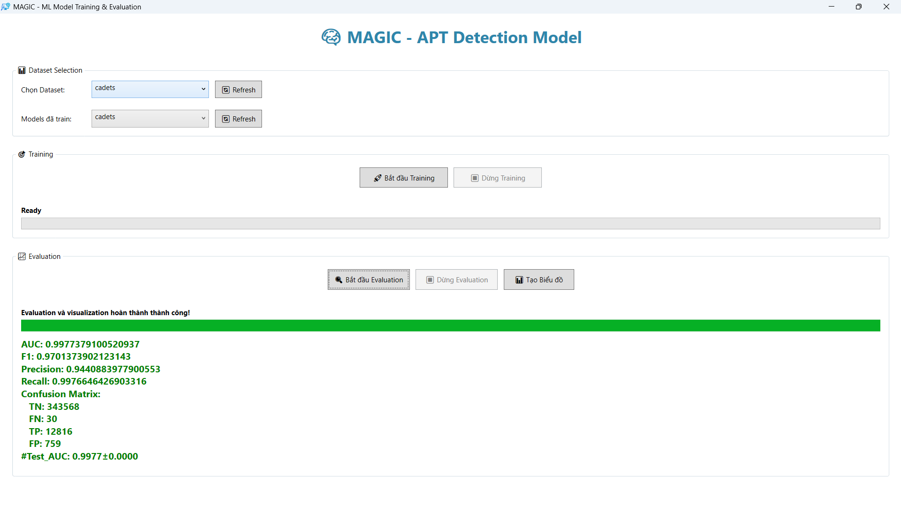
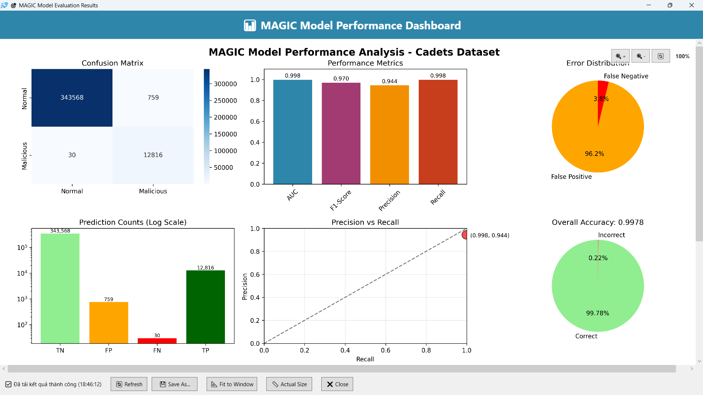

# WAGIC - WPF for MAGIC

**WAGIC** (Windows Application for Graph Intelligence & Classification) is a WPF-based graphical user interface for interacting with **MAGIC** - Detecting Advanced Persistent Threats via Masked Graph Representation Learning
<p align="center">


<p align="center">

</p>

## Overview

WAGIC provides a user-friendly graphical interface for:
- Training MAGIC models on different datasets
- Evaluating and assessing model performance
- Automatically generating and displaying visualization charts
- Real-time monitoring of training/evaluation progress
- Managing trained models

## System Requirements

### Frontend (WAGIC)
- **Windows 10/11**
- **.NET 8.0** or higher
- **Visual Studio 2022** (for development)

### Backend (MAGIC)
- **Python 3.8+**
- **PyTorch**
- **Flask**
- **NumPy, Pandas, Matplotlib**
- Other dependencies (see requirements.txt in MAGIC repo)

## Installation and Setup

### Step 1: Clone and setup MAGIC backend

```bash
# Clone MAGIC repository
git clone https://github.com/WanThinnn/MAGIC.git
cd MAGIC

# Install Python dependencies
pip install -r requirements.txt

# Run Flask API server
python app.py
```

Backend will run at: `http://localhost:5000`

### Step 2: Build and run WAGIC

```bash
# Clone WAGIC repository
git clone https://github.com/WanThinnn/WAGIC.git
cd WAGIC

# Build project
dotnet build

# Run application
dotnet run --project WAGIC
```

Or open `WAGIC.sln` in Visual Studio and run.

## Supported Datasets

WAGIC supports the following datasets:

- **cadets** - DARPA TC Cadets dataset
- **fivedirections** - Five Directions dataset
- **streamspot** - StreamSpot dataset  
- **theia** - DARPA TC Theia dataset
- **trace** - DARPA TC Trace dataset
- **wget** - Wget dataset

## Usage Guide

### 1. Training Model

1. **Select dataset** from "Dataset Selection" dropdown
2. **Click "Start Training"**
3. **Monitor progress** via progress bar and log
4. **Wait for completion** - model will be saved automatically

### 2. Evaluation Model

1. **Select dataset** that has a trained model
2. **Click "Start Evaluation"**
3. **View results** displayed on the interface:
   - AUC, F1, Precision, Recall
   - Confusion Matrix (TN, FN, TP, FP)
   - Test AUC with standard deviation

### 3. Visualization

- **Automatic**: Charts are generated automatically after evaluation
- **Manual**: Click "Create Chart" button anytime
- **Result Window**: Separate window displays charts with zoom/pan functionality

## API Endpoints

WAGIC communicates with MAGIC backend through the following APIs:

| Endpoint | Method | Description |
|----------|--------|-------------|
| `/api/datasets` | GET | Get list of available datasets |
| `/api/models` | GET | Get list of trained models |
| `/api/train` | POST | Start training process |
| `/api/train/status` | GET | Get training status |
| `/api/eval` | POST | Start evaluation process |
| `/api/eval/status` | GET | Get evaluation status |
| `/api/visualize` | POST | Generate visualization charts |
| `/api/latest-result-image` | GET | Get latest result image |

## Project Structure

```
WAGIC/
├── WAGIC/
│   ├── MainWindow.xaml      # Main interface
│   ├── MainWindow.xaml.cs   # Main logic
│   ├── result_windows.xaml  # Result display interface
│   ├── result_windows.xaml.cs # Result window logic
│   ├── App.xaml            # App configuration
│   └── WAGIC.csproj        # Project file
├── WAGIC.sln               # Solution file
└── README.md               # This file
```

## Troubleshooting

### API Connection Error
```
Error connecting to API: http://localhost:5000
```
**Solution**: Ensure MAGIC backend is running on port 5000

### Invalid Dataset Error
```
Invalid dataset. Choose from: [cadets, fivedirections, ...]
```
**Solution**: Select dataset from available dropdown options

### Model Not Trained Error
```
No model found for dataset X. Please train first!
```
**Solution**: Run training for that dataset before evaluation

### Unicode Error in Subprocess
```
UnicodeDecodeError: 'charmap' codec can't decode byte
```
**Solution**: Fixed in backend with encoding='utf-8'

## Upcoming Features

- [ ] Dark/Light theme toggle
- [ ] Real-time training metrics
- [ ] Model comparison tool
- [ ] Email notification when completed
- [ ] Batch processing multiple datasets
- [ ] Custom visualization options

## Contributing

1. Fork the repository
2. Create a feature branch (`git checkout -b feature/AmazingFeature`)
3. Commit your changes (`git commit -m 'Add AmazingFeature'`)
4. Push to the branch (`git push origin feature/AmazingFeature`)
5. Open a Pull Request

## License

Distributed under the MIT License. See `LICENSE` for more information.

## Authors

- **WanThinnn** - *Initial work* - [WanThinnn](https://github.com/WanThinnn)

## Acknowledgments

- **MAGIC Framework** - [MAGIC Repository](https://github.com/WanThinnn/MAGIC)
- **DARPA TC Program** - For providing the datasets used
- **PyTorch Team** - Main machine learning framework
- **Microsoft WPF Team** - GUI framework

## Contact

- GitHub: [@WanThinnn](https://github.com/WanThinnn)
- Project Link: [https://github.com/WanThinnn/WAGIC](https://github.com/WanThinnn/WAGIC)

---

**Star this repository if you find it helpful!**
